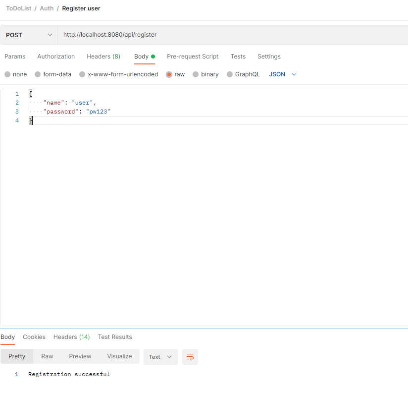
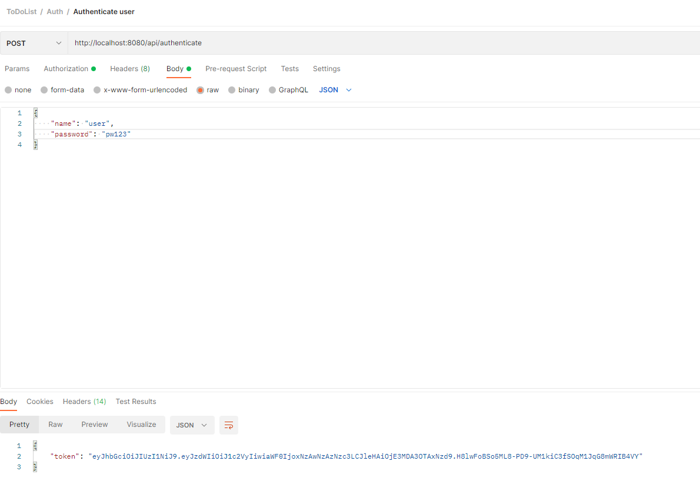
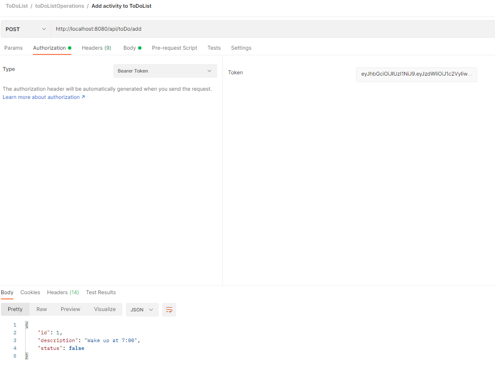
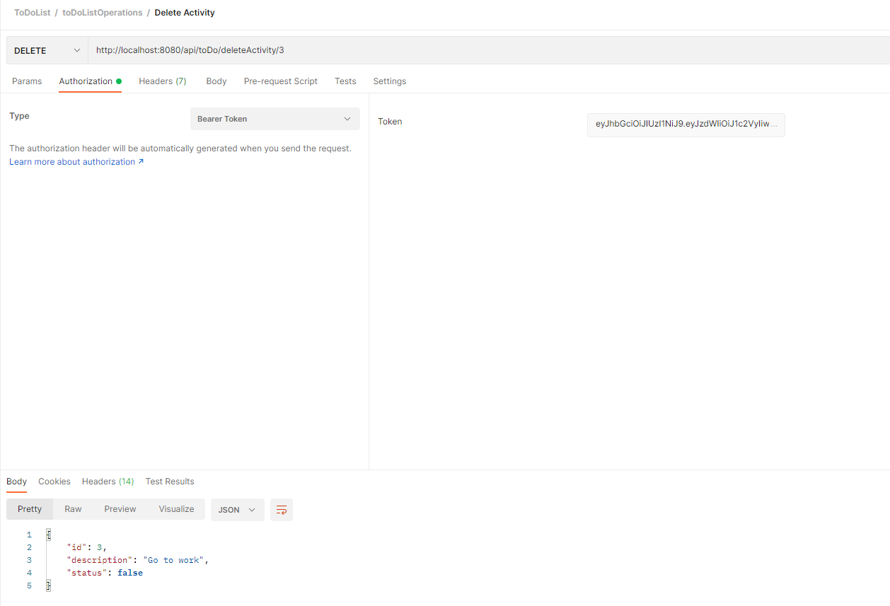
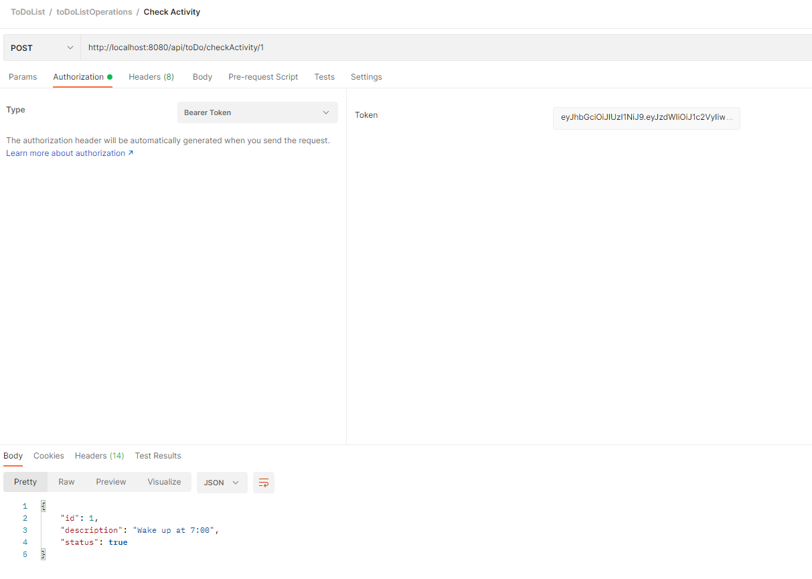
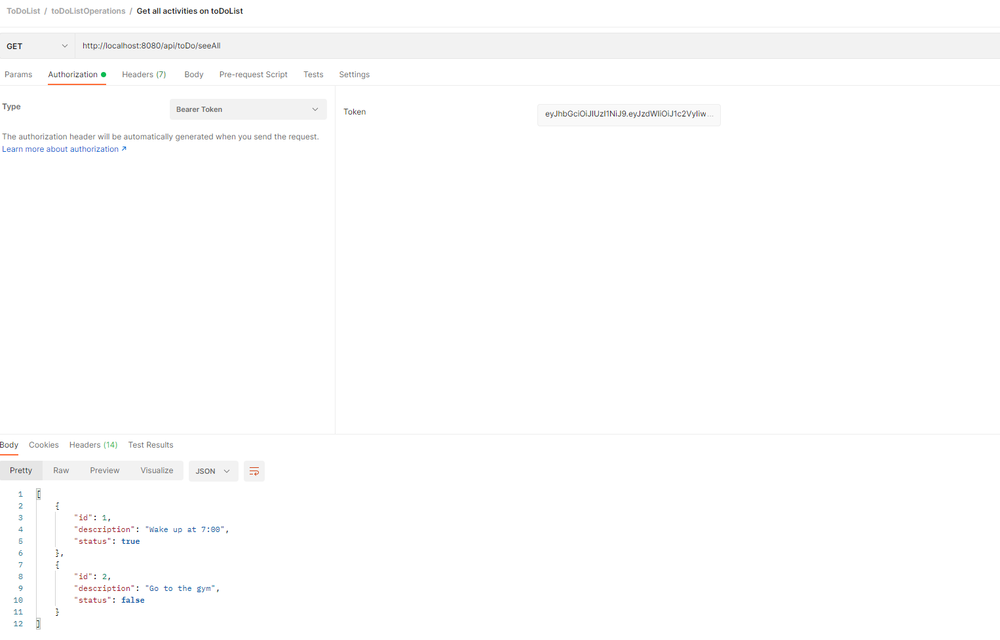

# To Do List App

## Start Client App

In the project directory, you can run:

### `npm start`

Runs the app in the development mode.\
Open [http://localhost:3000](http://localhost:3000) to view it in your browser.

The page will reload when you make changes.\
You may also see any lint errors in the console.

## End-2-End tests with Postman
Register a user by passing a username and password:

Authenticate based on the credentials -> if auth is successful, the user receives a JWT token.

Start adding tasks to your to do list:

You can also delete tasks:

Or check (mark activities as done):

And see the resulted to do list:

